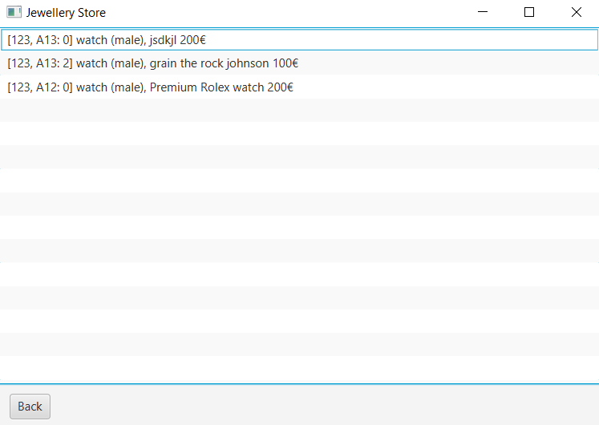

# Jewellery Store Application
Data Structures & Algorithms 1 CA1

This is a program for the purpose of keeping track of stock in a jewellery store. The program allows the user to add a display case to the application, display trays to a specific display case, and jewellery items to a specific display tray. Jewellery items can consist of different materials which can also be manually added. A save and load function is also in place for persistence. Stock valuation is also available for both the entire stock and each display case, and each item can be listed out all in the one place. A search function is available in order to list every jewellery item that contains an inputted string (eg. "ring" would yield all rings in stock). A smart add function is also available when adding a jewellery item in order to automatically identify display trays with similar items of jewellery and add the new item to it.

 Upon opening the application, it will look like this: 

 By clicking 'Add Case', you will see this screen where you can input details of your display case. Here you will give the case a unique ID of 3 numbers, specify whether the case is freestanding or wall-mounted, and lit or unlit. 

 Upon adding cases the home screen will display them in a list 

 By clicking 'Add Tray', you will see this screen where you can input details of a display tray, similar to adding the display case. On this screen, you will specify a unique ID of a capital letter followed by 2 numbers and which display case you want to add the display tray to. Along with these IDs, you will also specify the colour of the case and its dimensions 

 By clicking 'Add Item', you will see this screen where you can input details of a jewellery item that you want to add to the system. Here, you will specify an item description, a retail price, the type of jewellery, the target gender, and an image of the item. If manually adding the item to a tray, you will need to specify the IDs of the case and tray you wish to add it to. If adding it through the smart add function, you will not need to specify these IDs as the system will identify the best tray to add the item to. 

 Back on the home screen, you can double click a case to list out all of its trays. 

 From here, you can double click on a tray to list out all of the items contained within. 

 Double clicking one of these items will load a detailed description of the item, along with a list of materials contained within it. 

 By clicking 'Add Material/Component', you will see this screen where you can input details of the materials contained within the jewellery item. Here you will specify the type of material, give a description of it, and also specify its quantity and quality. 

 Back on the home screen, you can click 'List All Items' to list all jewellery items out in one list. Double clicking any of these items will bring you to its description screen. 

 To narrow down the list, you can type into the search bar on the home screen and click 'Search' to list out all items that contain the specified keyword(s) in its description or their materials' descriptions. As with listing all items, double clicking any of these items will bring you to its description screen. 

 By clicking 'Value Stock', the value of each case and each tray inside of each case will be displayed along with the total value of all cases. 

 Again back on the home screen, you can click 'Reset' to clear all cases, trays, items, and materials from the system. Clicking 'Save' saves all cases and their contents to a file. Clicking 'Load' loads the saved file, and must be pressed every time the program is run.
